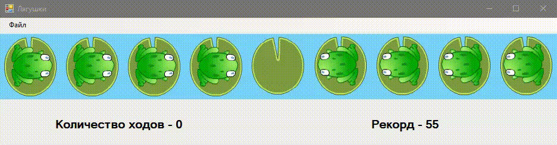

# Frogs game
🎮 🐸 Игра, созданная в процессе изучения технологии Windows Forms и работы с изображениями.
## Описание и пример работы приложения
Необходимо поменять лягушек местами, смотрящих вправо – направо, смотрящих влево – налево. Лягушки прыгают вперед и назад – на следующую кочку или через одну кочку в зависимости от наличия свободных.

